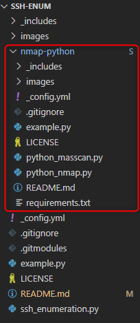

<a href="https://kaio6fellipe.github.io/"></a> 

# Information
> How about performing the inicial enumeration process of an ssh service using only 2 lines and receiving a dictionary with lots of information?
>
> Every time that I had to enumerate an ssh service in [Hack The Box](https://www.hackthebox.com/), I aways had to follow a certain sequence of steps. After a while, laziness won and I decided to use Python to automate this process.
>
> In this repository I use my [another repository](https://kaio6fellipe.github.io/nmap-python/) to make some custom scans with nmap, so, if you wanna use it, remember to configure my [nmap-python](https://kaio6fellipe.github.io/nmap-python/) functions too, I will explain it later.

# Configuration

Install [ssh-audit](https://github.com/jtesta/ssh-audit):
```shell
pip install ssh-audit
```

By default, Windows and Linux ahve ssh-keyscan preinstalled, to make sure, execute this line:
```shell
ssh-keyscan
```
Expected output:
```cmd
C:\Users\KAIO>ssh-keyscan                                                                                               usage: ssh-keyscan [-46cDHv] [-f file] [-p port] [-T timeout] [-t type]                                                                    [host | addrlist namelist] 
```

At the end, configure my [nmap-python repository](https://kaio6fellipe.github.io/nmap-python/), put the nmap folder inside the ssh-enum folder, if everything goes right, your folders will be organized that way:



# Details (In progress)

The ssh_enumeration.py file contains one class:
- iniEnumSSH

    This class contains the methods:
    - ssh_audit
    - ssh_keyscan
    - ssh_nmap
    - start
    - get_dict

# Example (In progress)

I usually use this class like that:

```python
# Some example in python right here
import ssh_enumeration

host = "10.0.0.248"
port = 22

enumeration = ssh_enumeration.iniEnumSSH(host, port)
enumeration.start()

dict = enumeration.get_dict()
print(dict)
```
This example will generete the following output after the scan that I did on the metasploitable machine:
```json
{
    "a-beautiful-dict" : "right here"
}
```